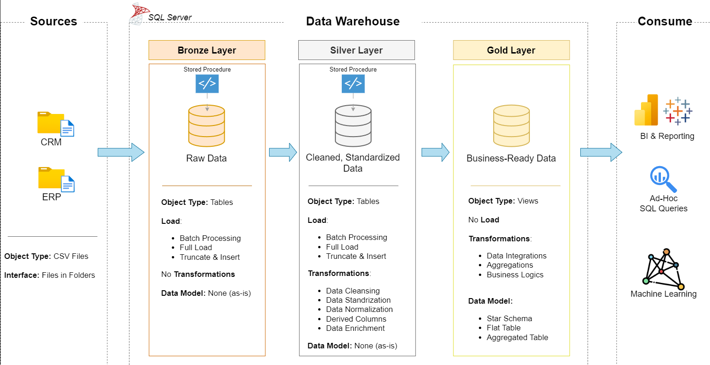
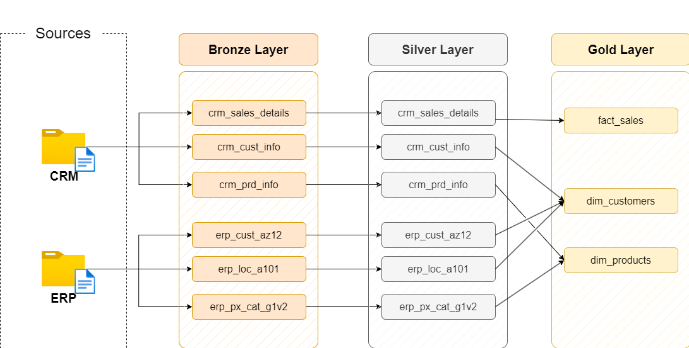
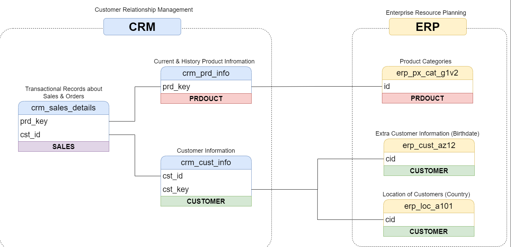

# 🏗️ Data Warehouse Project

Welcome to the **Data Warehouse Project**! 🚀  
This project demonstrates the design and implementation of a **modern data warehouse** using **Medallion Architecture** (Bronze–Silver–Gold) on **SQL Server**, enabling data-driven insights and analytics.

---

## 🧰 Technologies Used
- **Database:** Microsoft SQL Server  
- **ETL:** SQL Scripts (T-SQL)  
- **Data Modeling:** Star Schema, Medallion Architecture  
- **Data Sources:** CSV files (ERP and CRM systems)  
- **Version Control:** Git & GitHub   

---
## 📖 Project Overview

This project showcases the complete **data warehousing lifecycle**, including architecture design, ETL pipeline creation, and analytical modeling.

### Key Components
1. **Data Architecture:** Modern warehouse design using Medallion principles.  
2. **ETL Pipelines:** SQL-based Extract, Transform, and Load processes.  
3. **Data Modeling:** Development of Fact and Dimension tables optimized for analytical queries.  
4. **Documentation:** Clear technical documentation supporting analysts and stakeholders.  

---

## 🎯 Project Objectives

**Goal:**  
Build a scalable and reliable data warehouse in SQL Server that consolidates sales data from multiple systems to support analytical decision-making.

**Specifications:**
- Import and integrate datasets from two source systems (**ERP** and **CRM**)  
- Clean and transform raw data to ensure data quality and consistency  
- Design a **Star Schema** data model for easy analytical querying  
- Focus on the latest dataset (no historization required)  
- Provide documentation for both business and technical users  

---
## 🏗️ Data Architecture

This project follows the **Medallion Architecture** consisting of **Bronze**, **Silver**, and **Gold** layers:

| Layer | Description |
|--------|--------------|
| **Bronze Layer** | Stores raw data as ingested from source systems. Data is imported from CSV files into SQL Server. |
| **Silver Layer** | Performs data cleansing, standardization, and transformation to ensure consistency and quality. |
| **Gold Layer** | Contains curated, business-ready data organized into a **Star Schema** for analytics and reporting. |

---

## 🔄 Data Flow

This diagram shows how the tables move and transform across layers:

- Data from CRM & ERP is ingested into the **Bronze Layer**  
- Cleansing and normalization happens in the **Silver Layer**  
- Fact and Dimension tables are created in the **Gold Layer** for analytics  

---
## 🔗 Data Integration

Integration of ERP and CRM source systems ensures all necessary business data is available:

- Customer information is combined from ERP and CRM  
- Product and sales data are standardized and connected  
- Integration ensures a unified view of business operations  

---

## 🔗 Repository Structure
data-warehouse-project/
│
├── datasets/                           # Raw datasets from ERP and CRM
│
├── docs/                               # Documentation and diagrams
│   ├── data_architecture.png           # Data warehouse architecture
│   ├── data_flow.png                   # Data flow diagram
│   ├── data_models.png                 # Star schema data model
│   ├── data_catalog.md                 # Dataset catalog and metadata
│   ├── naming-conventions.md           # Naming guidelines
│
├── scripts/                            # SQL scripts for ETL and transformations
│   ├── bronze/                         # Raw data loading scripts
│   ├── silver/                         # Cleansing and transformation scripts
│   ├── gold/                           # Star schema and analytics models
│
├── tests/                              # Data validation and testing scripts
│
├── README.md                           # Project documentation
├── LICENSE                             # License information
├── .gitignore                          # Git ignore settings
└── requirements.txt                    # Optional dependencies

---

## 🎯 Key Deliverables
- End-to-end data warehouse architecture (Bronze → Silver → Gold)
- Fully documented ETL process using SQL scripts
- Business-ready Star Schema model
- Quality assurance checks for data integrity
- Ready-to-query datasets for analytics and BI tools  

---

